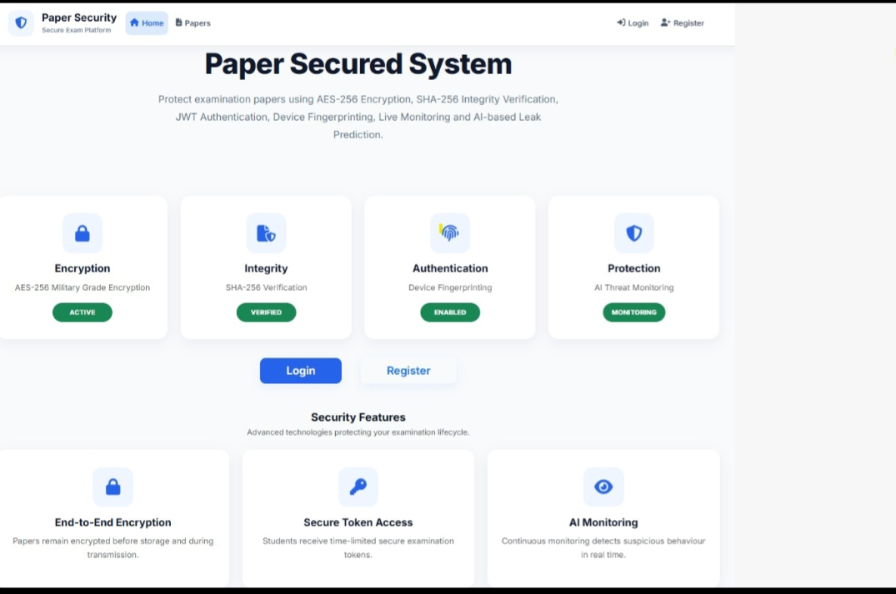
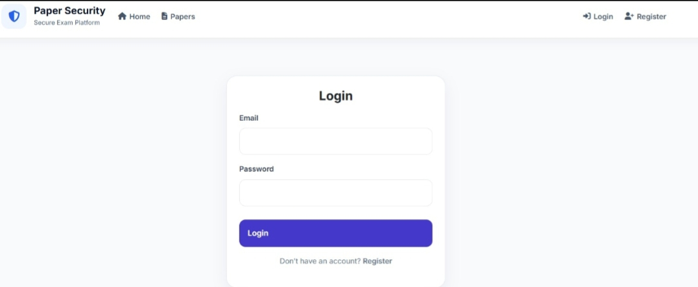
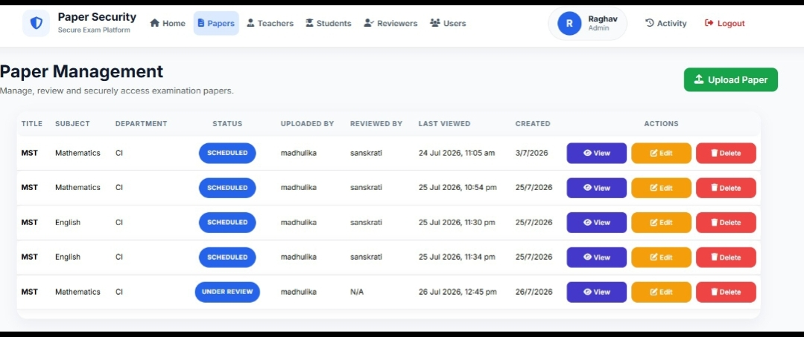
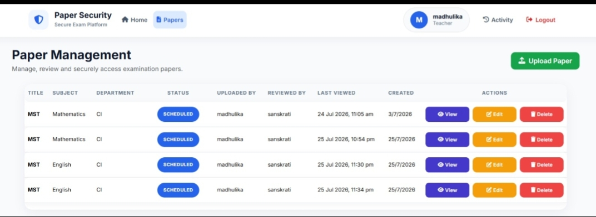
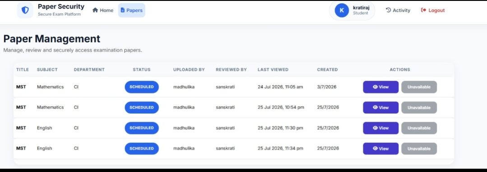
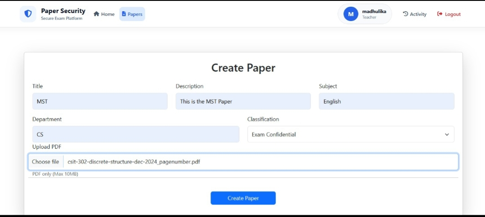
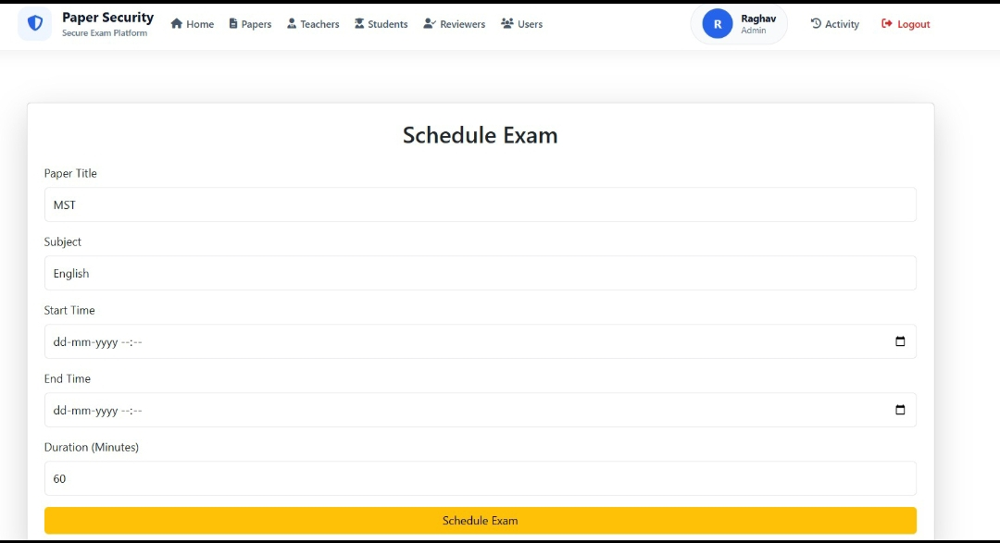
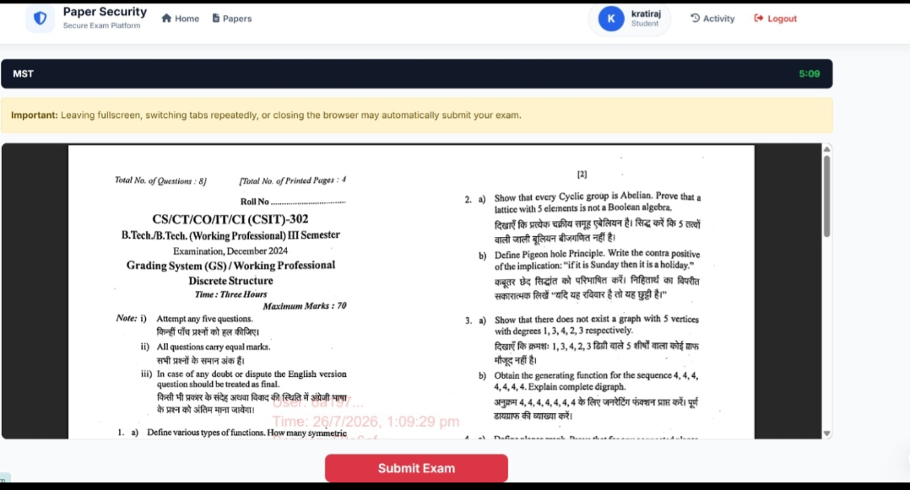
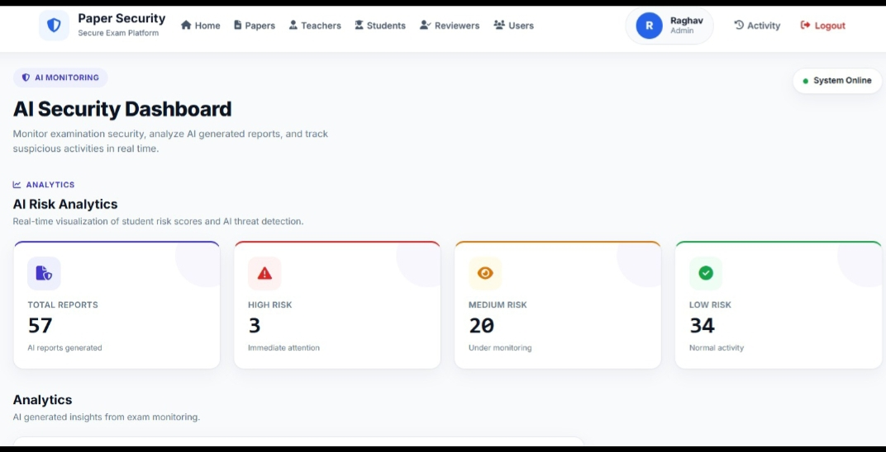
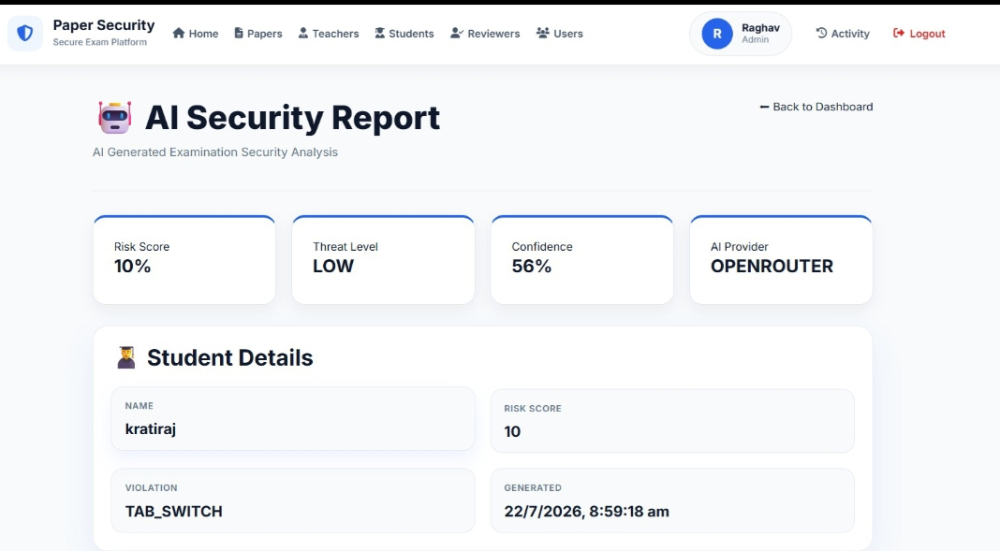

# 🔒 Secure Online Exam System

A secure web-based examination platform designed to prevent question paper leaks using encryption, role-based authentication, device verification, and AI-assisted security monitoring.

---

## 📌 Project Overview

The Secure Online Exam System is a backend-focused web application that securely stores and delivers examination papers. It protects confidential exam content using encryption and multiple security layers while allowing administrators, teachers, reviewers, and students to perform their respective tasks safely.

---

## ✨ Features

- 🔐 Secure Authentication & Authorization
- 👨‍🏫 Role-Based Access Control (Admin, Teacher, Reviewer, Student)
- 🔑 JWT Authentication
- 🔒 AES-256 Paper Encryption
- 🛡 SHA-256 Tamper Detection
- 📱 Device Fingerprinting
- 🔗 Session Binding
- 🚫 Tab Switching Detection
- 🖥 Fullscreen Monitoring
- 📊 AI-Based Risk Analysis
- 📝 Audit Logs
- 📄 Secure Paper Upload & Download
- 📈 Admin Dashboard

---

## 🤖 AI Features

- AI Security Advisor
- Risk Score Analysis
- Threat Level Prediction
- Security Recommendations
- AI Leak Prediction
- AI Confidence Score

---

## 🛠 Tech Stack

### Backend

- Node.js
- Express.js

### Frontend

- EJS
- HTML
- CSS
- JavaScript

### Database

- MongoDB

### Authentication

- JWT
- Express Session

### Security

- AES-256 Encryption
- SHA-256 Hashing
- Helmet
- Rate Limiting
- Device Fingerprinting

### AI

- Google Gemini API
- OpenRouter API
- OpenAI API (Optional)

---

## 📂 Project Structure

```text
Secure-Online-Exam-System/
│
├── Controllers/
├── Middleware/
├── Models/
├── Public/
├── Routes/
├── Services/
├── Storage/
├── Utils/
├── Views/
├── .env.example
├── .gitignore
├── app.js
├── package.json
├── package-lock.json
├── README.md
└── setUpFolder.js
```


# 📸 Project Screenshots

## 🏠 Home Page



---

## 🔐 Login Page



---

## 👨‍💼 Admin Dashboard



---

## 👨‍🏫 Teacher Dashboard



---

## 👨‍🎓 Student Dashboard



---

## 📄 Paper Upload



---

## 📅 Schedule Exam



---

## 📝 Exam Running



---

## 🤖 AI Security Dashboard



---

## 📊 AI Report




---

## ⚙️ Installation

### Clone Repository

```bash
git clone https://github.com/Nilesh907/Secure-Online-Exam-System.git
```

### Open Project

```bash
cd Secure-Online-Exam-System
```

### Install Packages

```bash
npm install
```

### Create Environment File

Create a `.env` file using the variables listed in `.env.example`.

### Start Server

```bash
npm start
```

or

```bash
node app.js
```

---

## 🔑 Environment Variables

```
PORT=

MONGO_URL=

SESSION_SECRET=

MASTER_SECRET=

SERVER_ENCRYPTION_SECRET=

AI_PROVIDER=

GEMINI_API_KEY=

OPENAI_API_KEY=

OPENROUTER_API_KEY=
```

---

## 🚀 Future Improvements

- Multi-Factor Authentication (MFA)
- Email Notifications
- Live Exam Monitoring
- Blockchain-Based Audit Trail
- AI-Based Cheating Detection
- Cloud Deployment
- OCR-Based Question Paper Verification

---

## 👨‍💻 Author

**Nilesh Sen**

Backend Developer | Node.js | Express.js | MongoDB

GitHub:
https://github.com/Nilesh907

---

## ⭐ If you like this project

Give this repository a ⭐ on GitHub.